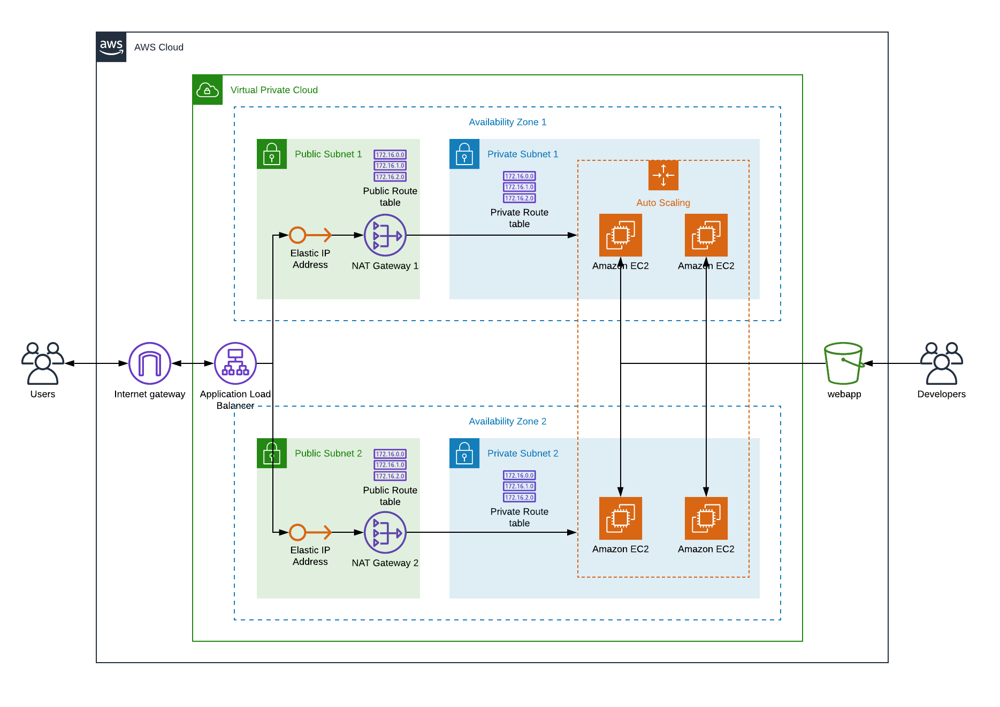

# **Udacity DevOps NanoDegree**
[](https://travis-ci.org/chaicko/udacity-infra-as-code)


## **Project 2: Deploy a High-Availability Web App using CloudFormation**
This repository show cases the solution for the for the second project on Infrastructure as Code of the Udacity DevOps Nanodegree.

---

## Problem

Your company is creating an Instagram clone called Udagram. Developers pushed the latest version of their code in a zip file located in a public S3 Bucket.

You have been tasked with deploying the application, along with the necessary supporting software into its matching infrastructure.

This needs to be done in an automated fashion so that the infrastructure can be discarded as soon as the testing team finishes their tests and gathers their results.

## Reference Architecture



The architecture to deploy into AWS is depicted in the previous diagram. The cloud formation templates
that implement the aforementioned architecture can be found in the `templates` subdirectory.

## Requirements

Python needs to be installed in the computer where you are running this. Also you need to have
permissions to install python packages in your workstation. It is assumed you are using a UNIX-based operating system.

Install the required Python packages with:
```
pip install -r requirements.txt -r dev-requirements
```

If you do not have enough permissions, then it is a good idea to use [Python Virtual Environments](https://uoa-eresearch.github.io/eresearch-cookbook/recipe/2014/11/26/python-virtual-env/) and then trying again.

## Setup

Setup your AWS account credentials on your computer by:

```
aws configure
```

Region `us-west-2` is assumed, make sure to select this.

*TODO: create different profile credentials, one for the WebApp developers (Access to S3 only) and the other for the Admins*

## Stacks

### S3 WebApp hosting

The DevOps team created a stack for the Web developers to upload their code:

```
$ ./create-update-stack UdagramDevelopersStack templates/developers.yml templates/developers-parameters.json
```

The `UdagramDevelopersStack` provides an S3 bucket where the developers upload their
HTML code.

### Infrastructure

#### Network

The production network infrastructure is created as the stack `UdagramProductionNetwork` with:

```
./create-update-stack UdagramProductionNetwork templates/network.yml templates/network-parameters.json
```

#### Servers

The production servers that run Udagram are created in the `UdagramProductionServers` CF stack:
```
./create-update-stack UdagramProductionServers templates/server.yml templates/server-parameters.json
```

## Demo

### WebApp application code upload

The Udagram developers do their coding in the `webapp` directory of this repository.

Once ready, they upload it using the following:
```
./upload-webapp -p parameters.json -d webapp
```

The `upload-webapp` script is just a helper that zips the file and copies it into S3.
The arguments to the script are a path to a json file with the S3 bucket and the zip filename to
upload to S3:
```
[
	{
		"ParameterKey": "S3BucketName",
		"ParameterValue": "schwoykoski-udacity-project2-bucket"
	},
	{
		"ParameterKey": "ZipFileName",
		"ParameterValue": "webapp.zip"
	}
]
```
Conviniently, the JSON parameters file is the same as the ones used for CloudFormation so when uploading
we pass the same parameters file used for the servers, only a subset of those are used. So when the
web developers are told to upload with:

```
./upload-webapp -p templates/server-parameters.json -d webapp
```

Once the developers upload their code they tell the DevOps team to re-deploy the servers
stack to get the updated code.

*TODO: create notifications when upload occurs*

### Re-creating the server infrastructure

After the develoeprs uploaded the new code (which they have verified) the DevOps re-create the servers
stack with :

```
./recreate-stack UdagramProductionServers templates/server.yml templates/server-parameters.json
```

### WebApp URL

The WebApp URL can be retrieved by using the following helper:
```
./get-webapp-url templates/server-parameters.json
http://Udagr-WebAp-12SOXAQQAZ01K-1344202734.us-west-2.elb.amazonaws.com
```
